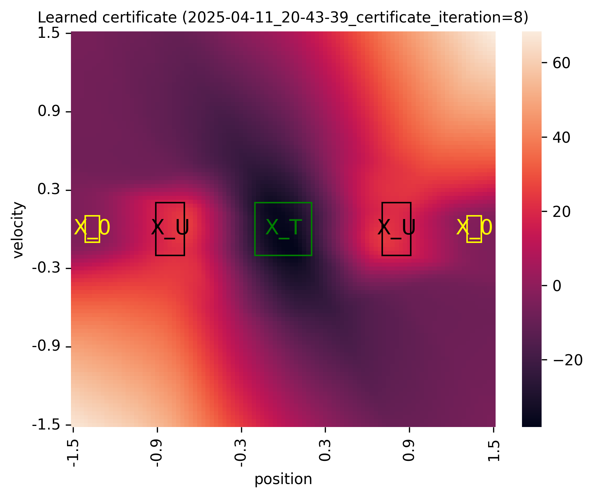
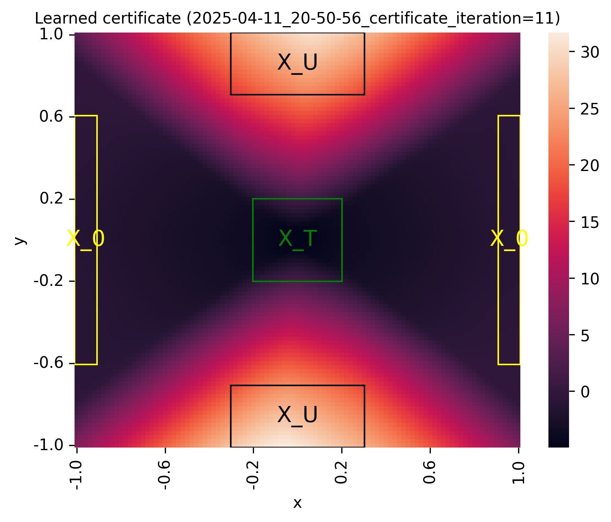
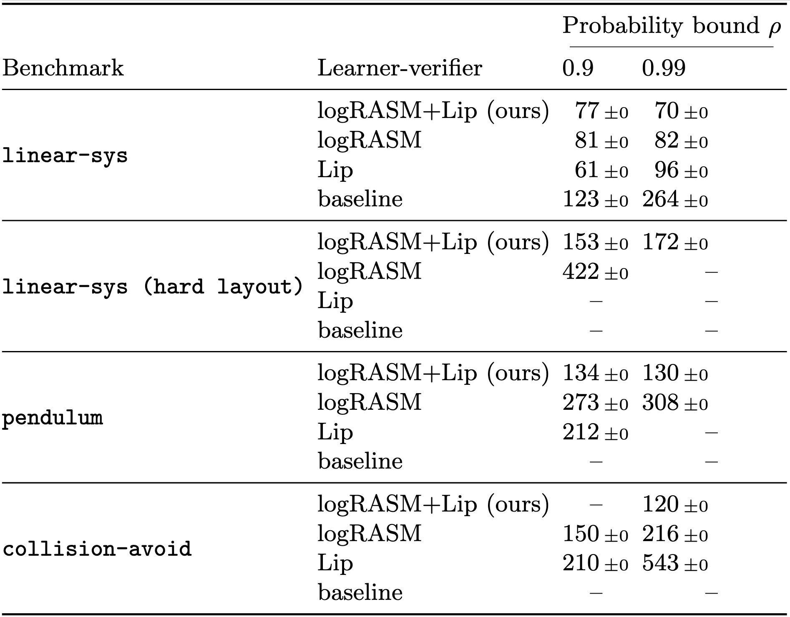
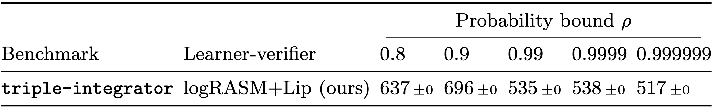

Policy Verification in Stochastic Dynamical Systems Using Logarithmic Neural Certificates
=============================

This repository contains the supplementary code for the paper:

- [1] [Policy Verification in Stochastic Dynamical Systems Using Logarithmic Neural Certificates](https://arxiv.org/abs/2406.00826) by Thom Badings, Wietze Koops, Sebastian
  Junges, and Nils Jansen (CAV 2025)

This paper proposes techniques that make the verification of neural network policies in stochastic dynamical systems more scalable.
In this artifact, we implement these techniques in a learner-verifier framework for verifying that a given neural network policy satisfies a given reach-avoid specification.
The learner trains another neural network, which acts as a certificate proving that the policy satisfies the task.
The verifier then checks whether this neural network certificate is a so-called logarithmic reach-avoid supermartingale (logRASM), which suffices to show reach-avoid guarantees.
For more details about the approach, we refer to the paper above.

### Table of contents

Contents of this ReadMe:

1. [What does this code do?](#1-what-does-this-code-do)
2. [Run from a Docker container (preferred)](#2-run-from-a-docker-container-preferred)
3. [Installing from source](#3-installing-from-source)
4. [Running for a single benchmark (smoke test)](#4-running-for-a-single-benchmark-smoke-test)
5. [Reproducing results from the paper](#5-reproducing-results-from-the-paper)
6. [Overview of input arguments](#6-overview-of-input-arguments)
7. [Rebuilding the Docker container](#7-rebuilding-the-docker-container)

### A note on CUDA / GPU acceleration

This code is written in JAX and can be run on GPU with CUDA. We provide a Docker container with CUDA support enabled (see [step 2](#2-run-from-a-docker-container-preferred) below).
While we have tested the Docker container on multiple systems (listed below), running JAX code with GPU acceleration within a Docker container can be tricky to set up. If you
encounter problems, feel free to open an issue on GitHub or send an email (thombadings@gmail.com).

The Docker container with GPU support enabled has been tested on:

1. Linux 6.1.0-23-amd64, running Debian GNU/Linux 12, Cuda version 12.5, NVIDIA driver version 555.42.06.
2. Linux 6.8.0-49-generic, running Ubuntu 22.04.5 LTS, Cuda version 12.4, NVIDIA driver version 550.120.

> **_NOTE:_** GPU acceleration with JAX is only fully supported via CUDA. The support of JAX for Apple GPUs is only experimental and is not enough to run our code. To reproduce the
> results form [1] in reasonable time, running our code with GPU acceleration is necessary. More details can be
> found in the [JAX installation guide](https://docs.jax.dev/en/latest/installation.html).

# 1. What does this code do?

While we refer to the paper [1] for details, we briefly explain what our code computes.
In a nutshell, given

1) a stochastic dynamical system, and
2) a reach-avoid specification, i.e., a tuple $(X_T, X_U, \rho)$ of a set of target states $X_T \subset X$, a set of
   unsafe states $X_U \subset X$, and a probability bound $\rho \in (0,1)$,

the code tries to learn a (neural network) policy that, when deployed on this system, satisfies the reach-avoid specification.
This is done by learning a formal certificate, called a logarithmic reach-avoid supermartingale (logRASM), which is represented as a neural network.
Finding a logRASM is a sufficient proof for the satisfaction of the specification.
Our code implements an iterative learner-verifier framework that tries to find a RASM for the given inputs.
If a valid RASM is found, our code terminates and returns the RASM as proof that the specification is satisfied.

# 2. Run from a Docker container (preferred)

The preferred way to run our code is by using the Docker container that we provide.
Our Docker container is built upon Ubuntu, on top of which we install Miniconda, JAX, and the other Python dependencies (see the Dockerfile in this artifact for details).

> **_NOTE:_** On Ubuntu, Docker binds by default to a socket that other users can only access using sudo. Thus, it may be necessary to run Docker commands using sudo.
> Alternatively, one can follow [this guide on the Docker website](https://docs.docker.com/engine/install/linux-postinstall/) to avoid having to run with sudo.

### Step 1: Pull or download the Docker container

We assume you have Docker installed (if not, see the [Docker installation guide](https://docs.docker.com/get-docker/)). Then, run:

```
docker pull thombadings/lograsm:v1
```

Or in case you downloaded this container from an (unpacked) archive (loading the container can take a few minutes):

```
docker load -i cav25_lograsm.tar
```

Our implementation is written in JAX and can be accelerated by running on an NVIDIA GPU with CUDA.
If you want to run with GPU acceleration, you can continue with step 2a; otherwise, you can continue with step 2b.

> **_NOTE:_** The Docker container above is built for AMD and X86 architectures. In addition, we also provide an ARM version of the container, which can be pulled from Docker Hub
> via `thombadings/lograsm:v1-arm` or loaded via `cav25_lograsm-arm.tar`. However, the ARM version of the container is not compatible with CUDA. Therefore, the runtimes with the
> ARM version are not representative of [1], and we recommend using the AMD / X86 version with GPU acceleration for serious benchmarking.

### Step 2a: Run with GPU acceleration

To run with GPU acceleration, you need to install:

1. The NVIDIA GPU driver and CUDA toolkit (see the introduction of the ReadMe for the versions we have tested on)
2. The NVIDIA Container Toolkit

We assume you already have the NVIDIA GPU driver and CUDA toolkit installed. The CUDA toolkit can be installed
from [the NVIDIA website](https://developer.nvidia.com/cuda-downloads).

Instructions for installing the NVIDIA container toolkit [can be found here](https://docs.nvidia.com/datacenter/cloud-native/container-toolkit/latest/install-guide.html).
For example, on Ubuntu or Debian, you can install the NVIDIA Container Toolkit as follows:

```
curl -fsSL https://nvidia.github.io/libnvidia-container/gpgkey | sudo gpg --dearmor -o /usr/share/keyrings/nvidia-container-toolkit-keyring.gpg \
  && curl -s -L https://nvidia.github.io/libnvidia-container/stable/deb/nvidia-container-toolkit.list | \
    sed 's#deb https://#deb [signed-by=/usr/share/keyrings/nvidia-container-toolkit-keyring.gpg] https://#g' | \
    sudo tee /etc/apt/sources.list.d/nvidia-container-toolkit.list
sudo apt-get update
sudo apt-get install -y nvidia-container-toolkit
sudo nvidia-ctk runtime configure --runtime=docker
sudo systemctl restart docker
```

To verify the NVIDIA Container Toolkit installation, you can run:

```
sudo docker run --rm --runtime=nvidia --gpus all ubuntu nvidia-smi
```

To use the docker container with GPU acceleration, open a terminal and navigate to the folder that you want to use to synchronize results.
Then, run the following command:

```
docker run --gpus all --runtime=nvidia --mount type=bind,source="$(pwd)",target=/home/lograsm/output -it thombadings/lograsm:v1
```

### Step 2b: Run without GPU acceleration

All experiments in [1] are run on a GPU, and we do not recommend performing serious benchmarking without GPU acceleration. However, you can run the Docker container without GPU
acceleration as well (be aware of significantly higher run times).

To use the docker container without GPU acceleration, open a terminal and navigate to the folder that you want to use to synchronize results.
Then, run the following command:

```
docker run --mount type=bind,source="$(pwd)",target=/home/lograsm/output -it thombadings/lograsm:v1
```

### Step 3: Running the code

After starting the Docker container with (step 2a) or without (step 2b) GPU acceleration, you will see a prompt inside the docker container. The README in this folder is what you
are reading. Now, you are ready to run the code for a single model (Section 4) or to replicate the experiments presented in [1] (Section 5).

# 3. Installing from source

For standard usage, we recommend using the Docker container, but you can also build our tool from source.
We recommend installing in a conda environment; however, other installation methods are also possible.
Below, we list the steps needed to install via (Mini)conda.

### Step 1: Install Miniconda

Download Miniconda, e.g., using the following commands ([see here](https://docs.anaconda.com/free/miniconda/) for details):

```
mkdir -p ~/miniconda3
wget https://repo.anaconda.com/miniconda/Miniconda3-latest-Linux-x86_64.sh -O ~/miniconda3/miniconda.sh
bash ~/miniconda3/miniconda.sh -b -u -p ~/miniconda3
rm -rf ~/miniconda3/miniconda.sh
```

Then, initialize Miniconda using the following commands (and close and re-open the terminal):

```
~/miniconda3/bin/conda init bash
~/miniconda3/bin/conda init zsh
```

### Step 2: Create a new conda environment

The following command creates a new conda environment, specifically with Python version 3.12:

```
conda create -n lograsm python=3.12
conda activate lograsm
```

Next, proceed with either step 3a or 3b (for installing with or without GPU acceleration via CUDA, respectively).

### Step 3: Installing dependencies

Our implementation uses Jax, which, in turn, can use GPU acceleration via CUDA.
However, installing CUDA can be tricky in some cases.
Thus, we recommend installing via Conda.
To install JAX with acceleration, run

```
pip install --upgrade "jax[cuda12]"
```

To install JAX without GPU acceleration, run

```
pip install --upgrade jax
```

Then, install the remaining requirements:

```
pip3 install -r requirements.txt
```

# 4. Running for a single benchmark (smoke test)

The main Python file to run the code is `run.py`.
See [Section 6](#6-overview-of-input-arguments) of this ReadMe for a full overview of the available input arguments.
A minimal command to train and verify a neural network policy is:

```
python run.py --model <benchmark> --probability_bound <bound> --pretrain_method <algorithm> --pretrain_total_steps <steps> --mesh_loss <mesh_loss>
```

In this command, `<benchmark>` specifies the benchmark to run, `<bound>` is the probability bound of the reach-avoid specification, `<algorithm>` is the method used to pretrain the
input neural network policy for the specified number of steps `<steps>`, and `<mesh_loss>` specifies the discretization cell width used in the learner's loss function (see below
for
the options).

## Smoke test

The following example can be run to verify if the code runs correctly. If the code runs on GPU, you should see `Running JAX on device: gpu` in the terminal output (after the
overview of the arguments):

```
python run.py --model LinearSystem --probability_bound 0.9999 --pretrain_method PPO_JAX --pretrain_total_steps 100000 --mesh_loss 0.001 --exp_certificate;
```

This example first pretrains a policy on the `linear-sys` benchmark for 100k steps using PPO and exports this policy as a checkpoint to the folder `ckpt/`. Then, this policy is
given as input to the learner-verifier framework, which trains a logRASM that verifies a reach-avoid specification with a probability bound of $\rho = 0.9999$.

- **Expected runtime for this command:** 1 minute on GPU, or 3 minutes on CPU.
- **Expected result:** A folder `output/date=<datetime>_model=LinearSystem_p=0.9999_seed=1_alg=PPO_JAX` is created, in which the following results are stored:
    - `<datetime>_certifcate_Iteration0.pdf` / `.png` shows the learned logRASM:

      
    - `info.csv` summarizes the most important info of the run (e.g., benchmark name, probability bound, total runtime, etc.)
    - `args.csv` contains a full overview of all arguments used by the run
      -`times.csv` lists the runtimes of each iteration and step of the run

Upon termination of the framework, the learned certificate is exported to the corresponding subfolder in `output/`, together with figures and CSV files
that summarize other relevant statistics of the run.

## Validating results

The file `validate_certificate.py` can be used to check the validity of a learned RASM empirically.
This validation can be called automatically upon termination of the learner-verifier by adding the argument `--validate` to the `run.py` script.
Alternatively, the validation can be called externally on a given checkpoint as follows:

```
python validate_certificate.py --checkpoint 'output/.../final_ckpt/' --cell_width 0.01
```

Here, `--checkpoint` should be given the path to the exported final checkpoint (stored in `output/<folder-of-run>/`), and `--cell_width` is the mesh size for the (uniform)
discretization used to validate the RASM empirically.

It is also possible to directly perform the validation for all checkpoints in a given directory:

```
python validate_certificate.py --check_folder 'output/subfolder-with-multiple-checkpoints/' --cell_width 0.01
```

Several other arguments can be passed; see `validate_certificate.py` for the full overview.

## Training policies with Stable-Baselines

By default, `run.py` trains policies with PPO (implemented in JAX).
For some experiments, we instead train policies with other RL algorithms implemented in [Stable-Baselines3](https://stable-baselines3.readthedocs.io/en/master/).
Since these implementations are not optimized for our code (and thus slow to run), we provide a script to externally pretrain policies using Stable-Baselines3.
This script is called `train_SB3.py` and can, for example, be used as follows:

```
python train_SB3.py --model LinearSystem --layout 0 --algorithm TRPO --total_steps 100000 --seed 1 --num_envs 10 --neurons_per_layer 128 --hidden_layers 3
```

The algorithms we use for our experiments are TRPO, TQC, SAC, and A2C (see [Section 5](#4.-reproducing-results-from-the-paper) for details).

> **_NOTE:_** We have experience issues running Stable-Baselines3 within the Docker container with GPU acceleration. run the `train_SB3.py` script above, please run the Docker
> container without GPU acceleration or build the code from source. Also, all Stable-Baselines3 policies needed to reproduce the results from [1] are already provided with the
> code.

# 5. Reproducing results from the paper

The results presented in [1] consist of five main parts:

1. Examples of trained logRASMs (Figure 5 in [1])
2. Ablation study on the 2D benchmarks (Table 1 in [1])
3. Ablation study on the 3D and 4D benchmarks (Table 2 in [2])
4. Experiments on the 2D benchmarks with policies pre-trained with other RL algorithms in Stable-Baselines3 (Table 3 in [1])
5. Comparison of our Lipschitz constants to LipBaB (Table 5 in the appendix of [1])

Since reproducing all these results takes multiple weeks, we also provide an option to reproduce the results partially.

## Resolving out-of-memory errors

The provided experiments scripts contain the same parameters as used in the experiments of [1], which are run on server running Debian, with an AMD Ryzen Threadripper PRO 5965WX
CPU, 512 GB of RAM, and an NVIDIA GeForce RTX 4090 GPU. When running on a machine with less resources, you might get out-of-memory errors. To resolve these issues, try lowering the
following parameters:

- `--verify_batch_size`, which is 30000 by default and can be reduced to, e.g., 5000 (or even lower)
- `--forward_pass_batch_size`, which is 1 million by default and can be reduce to, e.g., 100k

We recommend first lowering the `verify_batch_size`, and only changing `forward_pass_batch_size` if that does not resolve the error.

## Reproducing the results from [1] partially

To reproduce the experiments partially, run the following command in the main directory of the artifact (expected run time with GPU acceleration: about 8 hours):

```
bash experiments/run_partial_benchmarks.sh > output/partial_benchmarks.out;
```

Running this script generates the following outputs in the `output/` folder (if you followed the Docker instructions above, these results should also appear in the folder on the
host machine where you started the Docker container from):

- **Trained logRASM figures**: Plot the logRASMs for the four 2D benchmarks, exported to `output/figures/` and the respective subfoldere therein:

  

- **Ablation study (2D benchmarks):** Partial version of Table 1 in [1], exported to `output/main-benchmarks_table_<datetime>.tex` and `.csv`:

  
- **Ablation study (3D and 4D benchmarks):** Partial version of Table 2 in [1], exported to `output/hard-benchmarks_table_<datetime>.tex` and `.csv`:

  
- **Policies pretrained with Stable-Baselines3:** Partial version of Table 3 in [1], exported to `output/SB3-benchmarks_table_<datetime>.tex` and `.csv`:
  

## Reproducing the results from [1] completely

To reproduce the experiments completely, run all of the following commands. Note that the expected total runtime is multiple weeks.

First, reproduce the logRASMs presented in Figure 5 in [1] by running:

```
bash experiments/run_figures.sh > output/full_figures.out;
```

Second, the following command reproduces Tables 1 and 2 in [1] and exports these to the respective `.tex` and `.csv` files in the `output/` folder:

```
bash experiments/run_main.sh > output/full_main.out;
bash experiments/run_hard.sh > output/full_hard.out;
bash experiments/run_stablebaselines.sh > output/full_SB3.out;
```

For the Stable-Baselines3 experiments, we provide input policies trained with TRPO, TQC, SAC, and A2C as pretrained checkpoints in this repository (in the `ckpt_pretrain_sb3/`
folder). While not necessary for reproducing the results, you can retrain these policies by running:

```
bash train_SB3_all.sh > output/train_SB3_all.out
```

Finally, the following command runs the comparison to LipBaB, an anytime algorithm for computing upper bounds on Lipschitz constants for neural networks. These experiments are
presented in Table 5 in the appendix of [1], and can be reproduced by running (files exported to `output/LipBaB_table_<datetime>.tex`):

```
bash experiments/run_LipBaB.sh > output/experiments_LipBaB.out
python3 LipBaB_interpret_results.py < output/experiments_LipBaB.out > output/LipBaB_table.tex
```

This script runs LipBaB on several checkpoints of learned RASMs (together with the corresponding policy), which we provide as pretrained checkpoints in this repository.
The Python script `LipBaB_interpret_results.py` then takes the terminal output to produce Table 3 as presented in the appendix of [1], and exports this table to
`output/LipBaB_table.tex`.
For reproducing these results using a different set of checkpoints than the checkpoints that we provide in `ckpt_lipbab`, the script `bash collect_checkpoints_LipBaB.sh` can be
called on the `main` folder produced in the ablation study to collect and rename the specific checkpoints used in the LipBaB comparison.

> To be updated from here onwards...

# 6. Overview of input arguments

We provide an overview of the most important input arguments to the `run.py` script.
For an overview of *all arguments*, we refer to `core/parse_args.py` (note that some of these arguments are never
changed from their default values in our experiments).

All arguments are given as `--<argument name> <value>` or (in the case of boolean values) as `--<argument name>`.

## General arguments

| Arguments            | Default   | Help                                                                               |
|----------------------|-----------|------------------------------------------------------------------------------------|
| model                | n/a       | Gymnasium environment ID                                                           |
| layout               | 0         | Select a particular layout for the benchmark model (if this option exists)         |
| probability_bound    | 0.9       | Bound on the reach-avoid probability to verify                                     |
| seed                 | 1         | Random seed                                                                        |
| validate             | FALSE     | If True, automatically perform validation once certifcate was successfully learned |
| load_ckpt            | n/a       | If given, a PPO checkpoint is loaded from this file                                |
| pretrain_method      | PPO_JAX   | Method to pretrain (initialize) the policy                                         |
| pretrain_total_steps | 1_000_000 | Total number of timesteps to do with PPO (for policy initialization                |
| logger_prefix        | n/a       | Prefix to logger export file                                                       |
| silent               | FALSE     | Only show crucial output in terminal                                               |
| plot_intermediate    | FALSE     | If True, plots are generated throughout the CEGIS iterations (increases runtime)   |

## Enabling/disabling contributions (as for the ablation)

| Arguments             | Default | Help                                                                                                         |
|-----------------------|---------|--------------------------------------------------------------------------------------------------------------|
| local_refinement      | TRUE    | If True, local grid refinements are performed                                                                |
| weighted              | TRUE    | If True, use weighted norms to compute Lipschitz constants                                                   |
| cplip                 | TRUE    | If True, use CPLip method to compute Lipschitz constants                                                     |
| improved_softplus_lip | TRUE    | If True, use improved (local) Lipschitz constants for softplus in V (if False, global constant of 1 is used) |

## Learner arguments

| Learner                       | Default  | Help                                                                      |
|-------------------------------|----------|---------------------------------------------------------------------------|
| Policy_learning_rate          | 5,00E-05 | Learning rate for changing the policy in the CEGIS loop                   |
| V_learning_rate               | 5,00E-04 | Learning rate for changing the certificate in the CEGIS loop              |
| cegis_iterations              | 1000     | Number of CEGIS iteration to run                                          |
| epochs                        | 25       | Number of epochs to run in each iteration                                 |
| num_samples_per_epoch         | 90000    | Total number of samples to train over in each epoch                       |
| num_counterexamples_in_buffer | 30000    | Total number of samples to train over in each epoch                       |
| batch_size                    | 4096     | Batch size used by the learner in each epoch                              |
| expDecr_multiplier            | 1        | Multiply the weighted counterexample expected decrease loss by this value |

## Verifier arguments

| Verifier                  | Default   | Help                                                                                                                    |
|---------------------------|-----------|-------------------------------------------------------------------------------------------------------------------------|
| mesh_loss                 | 0.001     | Mesh size used in the loss function                                                                                     |
| mesh_verify_grid_init     | 0.01      | Initial mesh size for verifying grid. Mesh is defined such that \|x-y\|_1 <= tau for any x in X and discretized point y |
| mesh_verify_grid_min      | 0.01      | Minimum mesh size for verifying grid                                                                                    |
| mesh_refine_min           | 1,00E-09  | Lowest allowed verification grid mesh size in the final verification                                                    |
| max_refine_factor         | 10        | Maximum value to split each grid point into (per dimension), during the (local) refinement                              |
| verify_batch_size         | 30000     | Number of states for which the verifier checks exp. decrease condition in the same batch.                               |
| forward_pass_batch_size   | 1_000_000 | Batch size for performing forward passes on the neural network (reduce if this gives memory issues).                    |
| noise_partition_cells     | 12        | Number of cells to partition the noise space in per dimension (to numerically integrate stochastic noise)               |
| counterx_refresh_fraction | 0.50      | Fraction of the counter example buffer to renew after each iteration                                                    |
| counterx_fraction         | 0.25      | Fraction of counter examples, compared to the total train data set.                                                     |

# 7. Rebuilding the Docker container

The docker container (for AMD and X86 architectures) can be rebuilt from the source code by executing the following command in the root directory of the artifact (here, 1.0
indicates the version):

```
docker build --platform=linux/amd64 -f Dockerfile --tag thombadings/lograsm:v1 .
```

Similarly, the ARM version can be rebuilt by running (note, however, that the ARM version is not compatible with CUDA and thus does not allow to run our code using GPU
acceleration):

```
docker build --platform=linux/arm64 -f Dockerfile-arm --tag thombadings/lograsm:v1-arm .
```

If Docker returns permission errors, consider running the command above with `sudo` (or see the note earlier in this ReadMe for avoiding having to run using sudo).
